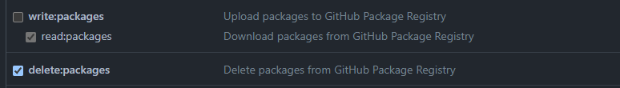

# Delete untagged images
This GitHub action allows the deletion of all deprecated (aka untagged) Docker images created in a repository.

## How to use
1. Create a new PAT with the following scopes
   
2. Add the PAT as a secret to the desired repo.
3. Create a new workflow and add the following:
```yaml
- name: Clean up old images
  uses: trisnol/delete-untagged-images@main
  with:
    owner: ${{ github.repository_owner }}
    repository: ${{ github.event.repository.name }}
    token: ${{ secrets.PERSONAL_ACCESS_TOKEN }}
```